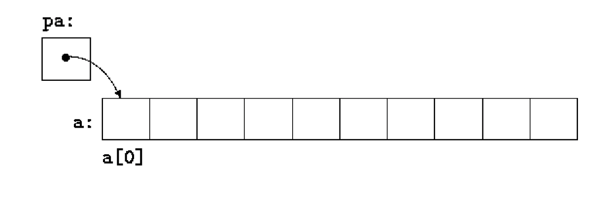

# lesson-7


### Pointers and Arrays
- A pointer is a variable that contains the address of a variable. 
- Pointers allow us to create more compact and efficient code
- Pointers and arrays are closely related
- ```void *``` (pointer to void) is the proper type for a generic pointer

Machine has an array of consecutively numbered or addressed memory cells that may be manipulated individually or in contiguous groups. 
- char - Any byte
- short integer - a pair of one-byte cells
- Long - four adjacent bytes 
- A pointer is a group of cells (often two or four) that can hold an address.

#### Unary operators:
- & 
  - gives the address of an object, so the statement ```p=&c;``` Assigns the address of c to the variable p, and is said to “point to” c.
  - The & operator only applies to objects in memory: variables and array elements. It cannot be applied to expressions, constants or register variables.
- \*
  - The indirection or dereferencing operator; when applied to a pointer, it accesses the object the pointer points to.


#### Pointer Example
- Every pointer points to a specific data type ... except a pointer to void.

```c
#include <stdio.h>

int main()
{
    int x=1, y=2, z[10];
    int *ip;            // ip is a pointer to an int

    ip = &x;            // ip now points to x
    printf("ip=%x\n", ip);   // prints address of x

    y = *ip;            // y is now 1
    printf("y=%d\n", y);

    *ip = 0;            // x is now 0
    printf("x=%d\n", x);

    ip = &z[0];         // ip now points to z[0]
    printf("ip=%x\n", ip);

    return 0;
}
```

#### Pointer exception example - Pointer to Void
- Segmentation Fault when you try to deference it!!

```c
#include <stdio.h>

int main()
{
    char *ptr = NULL; // Null pointer
    printf("%c", *ptr);

    return 0;
}
```

#### Pointers as function argument
```double *dp, atof(char *).```
- *dp and atof(s) have values of double
- Argument of atof is a pointer to char

#### Using Pointers:
If *ip points to the integer x, then *ip can occur in any context where x could, so  
```c
*ip = *ip + 10
y = *ip + 1
*ip += 1
++*ip
(*ip)++		// () are necessary; otherwise it will increment ip instead of what it points to
```
Pointers are variables, so they can be used without dereferencing:
```c
int *iq;
iq = ip;		// iq now points to whatever ip pointed to
```


#### Pointer Unary Operators * and & with arithmetic operators
- Be careful with order of operations!!

```c
#include <stdio.h>

void printArray(int arr[])
{
    for (int i=0; i<10; i++)
        printf("%d ", arr[i]);
    printf("\n");
}

void printArrayAddress(int arr[])
{
    for (int i=0; i<10; i++)
        printf("%x ", &arr[i]);
    printf("\n");
}

int main()
{
    int intArr[10] = {1, 2, 3, 4, 5, 6, 7, 8, 9, 10};
    printArray(intArr);
    printArrayAddress(intArr);

    int *intPtr = intArr;           // defaults to &intArr[0]
    printf("intPtr=%x\n", intPtr);
    printf("*intPtr=%d\n", *intPtr);

    int *intPtr2 = &intArr[2];      // address of intArr[2]
    printf("intPtr2=%x\n", intPtr2);
    printf("*intPtr2=%d\n", *intPtr2);

    printf("\n");

    *intPtr2 = *intPtr2 + 10;       // adds 10 to arr[2]
    printf("intPtr2=%x\n", intPtr2);
    printf("*intPtr=%d\n", *intPtr2);

    int y;
    y = *intPtr2 + 1;               // gets arr[2] and adds 1
    printf("y=%d\n", y);

    *intPtr2 += 10;                 // adds 10 to arr[2]
    y = *intPtr2;
    printf("y=%d\n", y);

    ++*intPtr2;                     // adds 1 to arr[2]
    y = *intPtr2;
    printf("y=%d\n", y);

    (*intPtr2)++;                   // adds 1 to arr[2]
    y = *intPtr2;
    printf("y=%d\n", y);

    *intPtr2++;                     // increments pointer to arr[3]! That's it!
    y = *intPtr2;
    printf("y=%d\n", y);
    return 0;
}
```

## Pointers and Function Arguments
C passes arguments to functions by value, so there is no direct way for the function to alter a variable in the calling function. 

#### Wrong Swap
```c
#include <stdio.h>

// K&R Pg. 95
void swap(int x, int y)
{
    int temp;

    temp = x;
    x = y;
    y = temp;
}

int main()
{
    int x = 1;
    int y = 2;
    printf("before: x=%d, y=%d\n", x, y);

    swap(x, y);
    printf("after:  x=%d, y=%d\n", x, y);
}
```
#### Correct Swap
```c
#include <stdio.h>

// K&R Pg. 96
void swap(int *px, int *py)
{
    int temp;

    temp = *px;
    *px = *py;
    *py = temp;
}

int main()
{
    int x = 1;
    int y = 2;
    printf("before: x=%d, y=%d\n", x, y);

    swap(&x, &y);
    printf("after:  x=%d, y=%d\n", x, y);
}
```


#### GETINT
```c
#include <stdio.h>
#include <ctype.h>

// K&R Pg. 97
int getch();
void ungetch(int);

#define BUFSIZE 100

char buf[BUFSIZE];  // buffer for ungetch
int bufp = 0;       // next free position in buf

int getch(void) // get a (possibly pushed back) charater
{
    return (bufp > 0) ? buf[--bufp] : getchar();
}

void ungetch(int c) // push character back on input
{
    if (bufp >= BUFSIZE)
        printf("ungetch:too many characters\n");
    else
        buf[bufp++] = c;
}

// getint: get next integer from input into *pn
int getint(int *pn)
{
    int c, sign;

    while (isspace(c = getch())) // skip white space
        ;

    if (!isdigit(c) && c != EOF && c != '+' && c != '-')
    {
        ungetch(c); // it's not a number
        return 0;
    }
    sign = (c == '-') ? -1 : 1;

    if (c == '+' || c == '-')
        c = getch();

    for (*pn = 0; isdigit(c); c = getch())
        *pn = 10 * *pn + (c - '0');

    *pn *= sign;

    if (c != EOF)
        ungetch(c);

    return c;
}

int main()
{
    int c, pn;
    c = getint(&pn);
    printf("c=%d pn=%d", c, pn);
    return 0;
}
```

## Pointers and Arrays
Any operation that can be achieved by array subscripting can also be done with pointers. The pointer version will in general be faster but, at least to the uninitiated, somewhat harder to understand.
```c
int a[10];
int *pa;
pa = &a[0]; 	// pa contains the address of a[0]
x = *pa;	// copy the contents of a[0] into x
```



If pa points to a particular element of an array, then by definition pa +1 points to the next element, pa+i points i elements after pa, and pa-i points i elements before. Thus, if pa points to a[0], *(pa+1) refers to the contents of a[1], pa+i is the address of a[i], and *(pa+i) is the contents of a[i].
These remarks are true regardless of the type or size of the variables in the array a.


Thus after the assignment 
```pa =&a[0];```
pa and a have identical values. Since the **name of an array is a synonym for the location of the initial element**, the assignment ```pa=&a[0]``` can also be written as 
```pa=a;```

Similarly ```a[i]``` is the same as ```*(a+i)```. The two forms are equivalent in C. 

Therefore  applying the & operator to both sides, shows that ```&a[i]``` and ```(a + i)``` are identical.

There is one difference between an array name and a pointer that must be kept in mind. A pointer is a variable, so ```pa=a``` and ```pa++``` are legal. But an array name is not a variable; constructions like ```a=pa``` and ```a++``` are illegal.

When an array name is passed to a function, what is passed is the location of the initial element. Within the called function, this argument is a local variable, and so an array name parameter is a pointer, that is, a variable containing address. Using this fact we can write the strlen function as below:


#### STRLEN
```c
#include <stdio.h>

// K&R Pg. 99
// strlen:return length of string s

int strlen(char *s)
{
    int n;

    for (n=0; *s != '\0'; s++)
        n++;
    return n;
}

int main()
{
    char str[] = "ABCDEFG";
    printf("strlen=%d\n", strlen(str));
    return 0;
}
```

Since ```s``` is a pointer, incrementing it is perfectly legal; ```s++``` has no effect on the character string in the function that is called strlen, but merely increments strlen’s private copy of the pointer. 

As formal parameters in a function definition, ```char s[];``` and ```char *s;``` are equivalent.

It is possible to pass part of an array to a function, by passing a pointer to the beginning of the subarray. For example, if a is an array, 
```f(&a[2])```
And 
```f(a+2)```
both pass to the function f, the address of the subarray that starts at ```a[2]```. In fact, if you are sure that the elements exist, it is also possible to index backwards in an array; ```p[-1], p[-2], … ```.

### ADDRESS ARITHMETIC

#### ANOTHER STRLEN
```c
#include <stdio.h>

// K&R Pg. 103
// strlen:return length of string s

int strlen(char *s)
{
    char *p = s;

    while (*p != '\0')
        p++;
    return p - s;
}

int main()
{
    char str[] = "ABCDEFG";
    printf("strlen=%d\n", strlen(str));
    return 0;
}
```

# Homework:
- The C Programming Language, 2nd Edition - Kerninghan & Ritchie, Chapter 5.1-5.9. This includes some reading ahead which will be really helpful for the next lesson.
- Hw link: https://classroom.github.com/a/oADhFQVU

